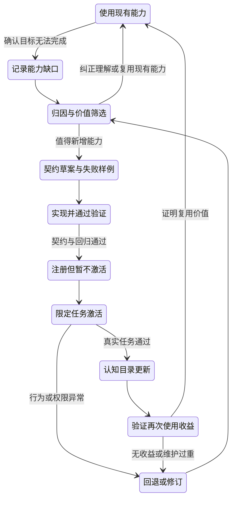

我的判断是：**VoxSign 应当成为一套由你拥有、能持续降低下一次工作成本的个人生产系统。它的核心资产是经过验证的认识、稳定的能力契约、可靠的执行器，以及把结果转化为改进证据的回路。**

我认同 Go 单二进制、认识与执行分离、个人上下文积累、多端点路由。我最大的保留是：**“代码最少化”不能变成“确定性最少化”，“三层分离”不能变成“三层各自正确、整体无人负责”。**10 倍效率只能作为经营目标，不能作为架构成立的前提。

以下以你提供的评审稿和骨架描述为基线。工作区读取受沙箱错误阻断，模型中心页面也未能通过浏览工具访问，因此不宣称核查过现有代码或该中心的实际协议。下文的工作量与验收数值均为设计建议。

**对第一个问题，我认为“生产底座”的最小定义是：一个能完成真实任务，并让下次同类任务少解释、少操作、少犯错的闭环。**

这个定义有四个必要条件：知道当前目标；能调用有限且可信的能力；能证明实际结果；能把经过确认的经验用于下一次任务。缺少最后一项，它是自动化工具；缺少前三项，它是知识仓库。

底座应积累四类资产：

| 资产 | 必须保留什么 | 如何产生复利 |
|---|---|---|
| 认识资产 | 目标、偏好、实体、术语及其来源和适用范围 | 减少重复解释与错误理解 |
| 能力资产 | 可重复调用的工具及稳定语义 | 降低同类工作的交付成本 |
| 证据资产 | 输入、决策、执行回执、用户纠正 | 让改进有依据，减少重复踩坑 |
| 验证资产 | 真实案例、失败案例、回归检查 | 让扩展和换模型不必重新冒险 |

这里的复利不是“记忆越多越好”，而是：**今天积累的资产，降低了明天创造另一项有效资产的成本。**例如，确认“美墅”在某个项目中指 Mansour，既改善下一次识别，也提高相关记录的检索准确性；检索改善，又让后续报价复核少一次人工寻找。

但错误也会复利。错误别名污染上下文，上下文强化错误判断，错误判断再被写入记忆，就形成了负向积累。因此，复利底座必须同时拥有纠错、撤销和淘汰机制。

判断某项设计是否值得做，我建议用五把尺：

1. **复用证据**：它解决了第二次出现的问题，还是只服务于想象中的未来？
2. **净节省**：把确认、返工、维护、模型费用都计入后，是否降低了你的总投入？
3. **迁移能力**：换模型、换端点、重写某个执行器，积累的知识和案例是否仍然可用？
4. **可验证性**：能否用历史案例判断这次修改是否改善了结果？
5. **维护负担**：每多一项能力，是否需要你持续增加监督和解释？

经营上应看：

`净收益＝重复使用次数×每次节省－建设成本－维护成本－错误损失`

这是一张核算清单，不是精确预测公式。它会迫使你拒绝“每天只用一次，却需要每周维护”的自动化。

OPC 最稀缺的资源通常是创始人的注意力。首要指标应是**每个合格结果占用多少分钟人工注意力**，其次才是延迟、调用费用与吞吐量。系统把十分钟操作压成三分钟，却增加十五分钟检查，生产率就是下降了。

10 倍效率可能来自理解、查找、执行、复用等多个环节的共同改善，但不能把各环节倍数直接相乘。没有解决的瓶颈、返工和维护会限制整体收益。V0 的任务是验证一个正向循环，不是证明十倍承诺。

**对第二个问题，三层应该切分为“可修订的判断、可检验的承诺、受约束的动作”，并由一个很小的运行内核把它们连接起来。**

三层是责任边界，不必对应三个服务，更不必对应三个进程。

| 层次 | 拥有什么 | 不应拥有什么 |
|---|---|---|
| 认知层 | 画像、OGSM、术语、任务解释、策略、工具使用示例 | 凭自然语言绕过权限或直接执行副作用 |
| 接口层 | 意图、工具、模型请求、结果、错误及版本语义 | 隐藏业务判断或供应商协议细节 |
| 执行层 | 输入处理、上下文装配、路由、校验、授权、工具、存储 | 自行猜测用户目标或静默改写契约 |

这里必须纠正“认知慢变”的含义：慢变的是价值取向、方法论和稳定规则；项目状态、预算余额、会话事实可以快变。**不能因为同属认知材料，就给它们相同的更新周期。**

建议的目录足够朴素：

```text
cmd/voxsign/main.go           # 装配依赖、命令入口
cognition/
  profile.md                 # 稳定偏好与工作背景
  ogsm.yaml                  # 当前目标、策略、指标、预算
  rules.md                   # 判断原则、回问原则
  lexicon.seed.yaml          # 已确认词汇种子
contracts/
  types.go                   # 运行时边界类型
  intent/v1.schema.json
  model/v1.schema.json
  tools/notes.add/1.0.json
  tools/notes.list/1.0.json
internal/
  engine/                    # 有限状态机、预算、停止条件
  input/                     # 原文留底、纠错候选
  context/                   # 画像、词典、事实的按需装配
  model/                     # 路由与协议适配器
  policy/                    # 权限、风险、确认绑定
  tools/                     # 注册表与具体执行器
  store/                     # 本地事务、轨迹与结果
eval/cases.jsonl              # 真实输入和预期行为
```

这是代码组织建议，不是要求每个目录发展成框架。`contracts` 不导入执行器；执行器实现契约；`main` 装配具体依赖；`engine` 通过明确接口调用它们。认知文件作为数据加载，不能夹带可执行脚本。

“模块可插拔”在这里首先指**实现可替换、装配可选择**。V0 使用编译时注册和配置启停即可。Go 官方文档列出了动态 `plugin` 的平台、工具链和依赖一致性限制；它不适合作为这个跨平台单二进制的默认扩展方式。[Go plugin 官方说明](https://pkg.go.dev/plugin)

新工具可以重新编译后发布。等到确有独立升级需求，再增加进程或远程适配边界。不要提前为插件市场支付复杂度。

正常数据流应当是：

```text
ASR文本
  → 原文持久化
  → 项目范围内的纠错候选
  → 装配相关画像、事实、能力目录
  → 模型提出结构化意图
  → 参数、语义与权限校验
  → 必要时回问
  → 固定动作与幂等标识
  → 工具执行
  → 持久化回执
  → 向用户报告
  → 形成待验证的改进候选
```

原文、纠错候选、最终采用文本必须分开存。不要把“美墅”全局替换成 Mansour：它可能指另一个实体，也可能就是字面含义。词典项至少包含原词、标准实体、项目范围、确认来源、状态与版本。

双向复用应这样实现：输入层读取已确认词典；认知层提出新增候选；确认后由存储层写入同一个实体与别名集合。**双向复用不等于允许两个模块分别维护一份真相。**

结构化意图可以保持很小：

```json
{
  "version": "1.0",
  "kind": "tool",
  "tool": "notes.add@1.0",
  "args": {
    "project_id": "p1",
    "entity_id": "e1",
    "text": "Mansour报价待复核预算"
  },
  "evidence": [
    {"slot": "entity_id", "source": "confirmed_alias:a1"}
  ],
  "missing": []
}
```

其中实体标识必须来自上下文中实际存在的记录。模型写出一个格式正确的 `e1`，不代表它引用了真实对象。执行前必须验证实体存在、项目一致、参数完整。

“低置信回问”也不能仅靠模型自报 `confidence=0.9`。V0 应依赖可观察信号：实体候选冲突、必填参数缺失、上下文矛盾、日期有歧义、目标超出授权。先对这些情况回问；积累标注案例之后，再讨论置信度校准。

权限判断由代码执行。模型可以建议风险等级，但实际等级来自工具定义、对象范围和动作内容。确认应绑定动作摘要、参数散列、契约版本与有效期；参数变化后，旧确认不能继续使用。

运行状态机至少需要：

```text
RECEIVED → INTERPRETING → VALIDATING
VALIDATING → NEEDS_CLARIFICATION → INTERPRETING
VALIDATING → NEEDS_APPROVAL → READY
VALIDATING → READY → EXECUTING → SUCCEEDED
任一前置状态 → REJECTED / CANCELLED
EXECUTING → FAILED / OUTCOME_UNKNOWN
```

`OUTCOME_UNKNOWN` 是重要状态：调用超时不一定等于操作失败。以后接入远端写操作时，系统必须先查询结果或人工核对，不能无条件重放。

V0 的本地记录、幂等凭证和成功回执应在同一个 SQLite 事务中提交。可以采用不依赖 CGo 的驱动，以保留单二进制部署和目标平台交叉编译路径；具体平台仍应实际构建验证。[modernc SQLite 驱动说明](https://pkg.go.dev/modernc.org/sqlite)

这比自行拼接 JSONL、文件写入和锁更符合“最少自研代码”。SQLite 的原子提交机制已有明确设计，但不能据此推导出远端 API 的副作用也获得事务保证。[SQLite 原子提交说明](https://www.sqlite.org/atomiccommit.html)

幂等标识由内核生成并持久化，重试时复用；同一标识配不同参数必须拒绝。不能用“文本相同”判断重复，因为用户可能确实要记两条相同内容。调用者显式标识与参数一致性，也是成熟幂等 API 的关键设计。[AWS 幂等 API 设计](https://aws.amazon.com/builders-library/making-retries-safe-with-idempotent-APIs/)

轨迹保持追加写，当前状态可以是可更新的投影。错误事实通过新事件纠正，不篡改历史；失效记忆停止参与上下文。不要因为强调 append-only，就把所有历史内容永久塞进提示词。

现有 ActionPlan 应降级为**建议结构**。V0 每轮最多一个工具动作，并限制模型轮数、时间与费用。完整多步计划越早出现，越容易把“模型预想的未来”误当成“已经验证的执行条件”。

生长回路必须独立于正常任务回路：



每次缺口至少记录原始请求、期望结果、现有能力为何不足、临时处理成本。否则，“生长”会退化成模型不断建议新工具。

归因不能只有“模型错、执行错”两格，还要区分输入错误、上下文错误、契约不足、模型判断错误、执行错误和外部环境变化。注册了工具却没有提供给模型，属于装配错误，不应靠改提示词掩盖。

新能力的准入条件是：有真实案例、有明确作用域、有输入输出、有失败语义、有权限边界、有可验证结果。模型可以起草契约与代码，**正在运行的 harness 不得自行编译、装载并给自己增权**。V0 的生长由你通过普通开发流程完成。

“认知层学会”也无需训练模型：执行器注册后，生成带版本的能力目录和少量使用示例；下一次请求装配进去，再用真实案例验证它能选对工具。安装成功与学会使用是两个不同验收点。

“冻结边界、一次只动一层”应解释成**分阶段改变、逐阶段验证**：

- 认知修改：固定契约、执行器和模型后端，用同一批案例比较。
- 契约修改：先增加未激活版本，保留旧调用路径和兼容测试。
- 执行修改：按新契约实现，通过测试后注册，最后更新认知目录。

一个新能力最终必然涉及多层。机械地禁止跨层修改，只会让生长无法发生。应冻结的是每个验证阶段的其他变量。

每次运行固定认知版本、契约目录版本、二进制版本、路由配置和所用记忆快照。重放分两种：用录制结果检查确定性逻辑；重新调用模型检查行为质量。后者无法承诺逐字复现。

**对第三个问题，模型中心应该是默认后端，而不应该成为底座的所有者。**

画像、词典、工具契约、授权、执行回执、评估案例都应留在你掌握的本地结构中。模型中心可以负责统一鉴权、供应商路由和调用计量；私域后端可以提供另一条推理路径。二者都不应成为个人上下文唯一存放处。

内部边界可以只有：

```go
type ModelBackend interface {
    Infer(
        context.Context,
        ModelRequestV1,
    ) (ModelReplyV1, error)
}
```

请求表达任务、上下文、可用能力、输出要求和预算；回复表达决策候选、工具调用建议、用量和停止原因。供应商消息格式、HTTP 头、错误体和流式片段都由适配器处理。

统一接口需要配套**能力声明**：是否支持结构化输出、工具调用、流式响应、所需上下文容量。不能把所有供应商字段塞入一个万能对象，再宣称完成了抽象。

供应商协议确实存在结构差异。例如 Anthropic 将工具调用和结果放入消息内容块，客户端工具仍由应用执行。这类差异应被适配器吸收，工具执行权留在本地。[Anthropic 工具调用文档](https://platform.claude.com/docs/en/agents-and-tools/tool-use/handle-tool-calls)

路由配置至少包含：

`后端标识、地址、凭证引用、协议类型、模型标识、能力声明、数据允许范围、超时、预算`

模型中心和私域直连是两个配置实例；若协议相同，可以共用一个适配器。只有真实协议不同，才新增实现。不要为了证明“可替换”而人为制造重复代码。

路由顺序必须是：**数据可去哪里→能力是否满足→预算与可用性→质量和速度**。私域请求不能因为失败而自动转发到公开端点；输入纠错和意图识别同样属于数据出域，不能只保护最后一步生成。

V0 采用默认中心、显式私域配置、任务内固定后端。备用路由只能在允许的数据范围内启用，且要记录额外调用费用。工具已执行或结果不明时，不能通过换模型重跑整段计划。

版本至少分成三条独立轴：

| 版本轴 | 变化对象 | 不能混为一谈的事情 |
|---|---|---|
| 模型边界版本 | 内部请求、回复语义 | 增加供应商不必升级内部契约 |
| 工具契约版本 | 参数、结果、副作用 | 换模型不等于换工具版本 |
| 认知版本 | 规则、示例、画像快照 | 改提示词不等于协议升级 |

兼容必须覆盖语义，而不仅是 JSON 能否解析。Google 的兼容指南也明确区分源码、传输与语义兼容。[Google AIP-180](https://google.aip.dev/180)

对 VoxSign，我建议采用以下规则：

- 已发布契约文件不可覆写；修改产生新修订。
- 可选字段只有在默认行为保持不变、消费者确认兼容时，才算小版本增量。
- 新增必填字段、改变单位、默认值、权限含义或副作用，使用新主版本。
- 输出枚举扩展必须检查旧消费者；不能假定“只增不改”天然安全。
- 每个运行绑定精确版本；协商和升级发生在任务开始前。

尤其要警惕严格 JSON Schema：`additionalProperties: false` 会拒绝未知字段，所以“增加字段”也可能破坏兼容。[JSON Schema 对象规则](https://json-schema.org/understanding-json-schema/reference/object)

解决办法是保留版本化 schema，并为旧消费者提供旧版输出投影。不要为了兼容而让执行入口静默吞掉陌生参数。

v1→v2 应当双版本并存：先实现 v2，再让部分新任务使用；v1 调用继续获得 v1 语义。只有语义能完整保持时，才用 v1→v2 适配。无法无损转换就明确拒绝，不能偷偷补造参数。

旧契约可以归档，但停止支持必须以没有在途任务、旧记录仍可解释、迁移已验证为条件。append-only 保护历史，并不意味着必须永远维护每条旧执行路径。

灰度要分两类：**协议兼容灰度**检查解析、错误、超时和调用关联；**认知行为灰度**检查理解、工具选择、参数与回问。前者通过，后者仍可能失败。

个人系统流量小，我不赞成照搬“随机 1% 流量”。先用同一批真实案例离线比较，再做只生成候选、不执行副作用的影子运行，最后按指定项目或低风险任务启用。影子调用也必须遵守数据范围与预算。

切换信号按优先级排列：越权与错误副作用为否决项；任务正确率和纠错负担决定是否值得切换；结构有效率与超时判断稳定性；费用和延迟用于同等质量下的选择。V0 可要求候选后端通过全部边界案例，再在十次低风险真实任务中由你逐条复核。这个数量只是工程门槛，不代表统计证明。

回退不仅是换回模型名，还要回退对应认知包、契约选择和路由配置。已经发生的外部副作用，需要独立的核对或补偿，不能靠回退配置消失。

**对第四个问题，我建议两周只交付一个窄而完整的生产闭环：项目记录的可靠写入，以及通过生长增加查询能力。**

最小认知种子不需要“完整数字分身”，只需要五项：

1. 一个当前项目，以及本周期最重要的结果。
2. 一条判断优先级的规则，例如先减少遗漏，再追求自动执行。
3. 明确的时间、费用和授权边界。
4. 少量已确认的实体、别名和项目归属。
5. 什么叫成功、何时回问、哪些信息仍然未知。

OGSM 的未知字段就标记未知。不能根据一句“报价”自行推断预算，也不能把“希望少操心”翻译成“允许自动发消息”。Mansour 的实体类型和适用项目同样需要确认，不能凭名字假定。

最小代码内核包括：常驻文本入口、原文存储、词典候选、上下文装配、模型适配器、严格意图校验、简单权限规则、工具注册、SQLite 事务、结果回执和有限状态机。

我的预算是**约 2000—3000 行生产 Go 代码，另加 800—1500 行有实际价值的测试与样例**，不含依赖。这是工作量估计，不是代码竞赛。已有骨架能复用多少，需要实际核查。数百行可以演示调用，但很难同时兑现重启恢复、幂等、版本和回问。

第一条端到端路径应是：

用户输入：“在当前项目记一条，美墅报价待复核预算。”

系统保存原文；若别名未确认则回问；用户确认此处指 Mansour；系统生成结构化意图，在允许的本地项目中写入记录，返回记录编号和实际内容，并保存该范围内的确认别名。下一次同类输入不再重复询问。

随后用户提出：“把这个项目最近记的事项列出来。”起初没有查询能力，系统登记能力缺口。你新增 `notes.list@1.0` 契约与实现，通过验证后注册并更新能力目录。再次提出同类请求，模型正确调用并返回记录。

这同时验证两种复利：**纠正一次，减少下一次解释；补齐一次能力，减少下一次操作。**首轮成功不要求系统自主写代码。

两周按十个工作日安排：

| 时间 | 必须交付 | 当日完成标准 |
|---|---|---|
| 第1日 | 冻结项目范围、成功定义、认知种子；整理30条真实样例 | 其中10条封存作验收，不参与调提示词 |
| 第2—3日 | 常驻文本入口、原文留底、词典候选、上下文装配 | 重启后能找到原文；歧义不会被静默覆盖 |
| 第4—5日 | 中心调用、意图校验、`notes.add`、事务与回执 | 输入到持久化记录闭环跑通；重试不重复 |
| 第6—7日 | 回问恢复、能力缺口登记；按流程增加`notes.list` | 有可查的契约、实现、注册、再次使用证据 |
| 第8日 | 私域配置、协议适配验证、路由约束 | 两个真实端点分别完成同一类意图请求 |
| 第9日 | 崩溃、超时、版本、越权和回退验证 | 错误不会伪装成成功，旧版本仍可工作 |
| 第10日 | 封存样例验收与真实使用核算 | 给出正确率、人工投入、维护成本和未解决问题 |

在第五日以后就开始真实使用，边用边记录耗时，不能等最后一天演示。若私域端点尚不可用，可以用模拟后端验证适配器，但必须把“双真实端点验收”标为未完成。

V0 坚决不做：ASR 引擎、音频链路、center WebSocket 全协议、网页控制台、向量数据库、知识图谱、通用工作流语言、多智能体、自主代码发布、动态 Go 插件、外部消息发送、任意 shell、跨工具事务和自动模型竞价路由。

画像与 OGSM 用版本化文件，事实和轨迹用本地数据库；暂不构建通用记忆服务。只支持项目范围内的确定性查询，不为两项工具引入语义检索平台。

验收要同时满足功能、边界与收益：

- **正确完成**：30条端到端样例至少27条符合人工预期；该回问、该拒绝也算正确，单纯 JSON 合法不算。
- **边界可靠**：所有预设歧义、未知工具、越权、额外参数案例均不产生错误写入。
- **恢复可靠**：同一幂等标识重复提交只产生一条记录；提交前、提交后及回执前崩溃均有明确恢复结果。
- **沉淀有效**：确认别名在后续新案例中发挥作用，同时通过“美墅确指其他对象”的反例。
- **生长成立**：查询能力从缺口到可调用有完整记录，新增后原有写入案例继续通过。
- **替换成立**：两个后端通过共享契约检查；数据受限请求不会跨越允许范围。
- **经营有效**：至少15次真实使用记录人工操作、确认和纠错时间；与直接手工记录比较，报告净变化。

收益门槛可暂定人工主动操作时间下降30%，同时每次复查成本不增加。这是是否继续投入的门槛，不应冒充具有统计显著性的结论。如果收益没有出现，就先修正场景和交互，不继续扩建底座。

测试重点是状态转移、错误副作用、事务恢复、版本兼容和真实输入行为。`go test`、适用平台上的竞态检查、目标平台构建都要运行；模型行为测试单独报告，避免把网络波动混进确定性单元测试。

**对第五个问题，最可能的失败模式是：系统持续积累未经验证的认识，而你把“积累很多”误认为“理解加深”。**

一次模型猜测被存为事实，下一轮又作为依据进入提示词，最终形成自我强化。模型可能越来越熟悉自己的叙事，却越来越偏离你的实际工作。防线是区分用户明确陈述、工具观测、模型推断；保留来源与适用期；推断进入候选区，不能直接升级成稳定画像。

第二个失败模式是**把文字当成免维护代码**。规则写在 Markdown 中，仍会改变生产行为。它一样需要版本、案例和回退，而且自然语言歧义可能让验证更难。偏好、策略适合文字；金额上限、授权范围、允许目标和预算扣减必须成为机器可检验的约束。

第三个失败模式是**接口正确掩盖语义错误**。一个计划可以完全符合 schema，却记录错人、选错项目、误解日期。认识与执行分离能够定位错误、限制影响，但无法消灭意图到行动之间的语义落差。必须同时核对用户表达、模型解释、工具参数和实际回执。

第四个失败模式是**增长速度超过维护能力**。每个工具都带来权限、说明、测试、版本和回归成本。工具越多，选择也可能越差。应该定期停用低频高维护能力，合并重复能力，并把常用能力组合沉淀为经验证的流程。长期增长不要求能力数量单调增长。

第五个失败模式是**为了让自己更高效，先给自己创造一个永久维护项目**。最危险的指标是“本周新增多少模块”；最有用的指标是“本周少花多少注意力”。如果架构周报比真实工作回执更丰富，方向已经偏了。

我对作者最直接的提醒是：你可能把自己的方法论一致性，当成了真实需求已经得到验证的证据。OGSM、认识与执行分离、三层生长都能帮助思考，但它们不能替代连续使用中的摩擦反馈。用户模型应解释你的行为，而不是要求你配合它的分类。

我最大的反对意见是对“分得越清越好”的绝对化。**责任必须清楚，交互必须充分。**认知层需要知道工具的限制与失败语义，执行结果必须反馈到认知层；若追求彻底隔离，边界上就会出现无人负责的误解。契约应当帮助协作，而不是制造免责区。

另一个保留是“个人化就应该自建服务”。真正值得自建的是个人语义、决策规则和上下文组织；数据库、协议客户端、schema 校验和认证机制仍应复用基础设施。个人化主要发生在数据和规则上，不必发生在每一层技术实现上。

第十四天应做一个明确决定：如果你已开始自然使用它，重复解释减少，一次能力增长确实改善了下一次任务，就继续投资；如果只有漂亮的分层、很多契约和一次顺利演示，就冻结扩展，回到那个最值得每天使用的具体场景。
